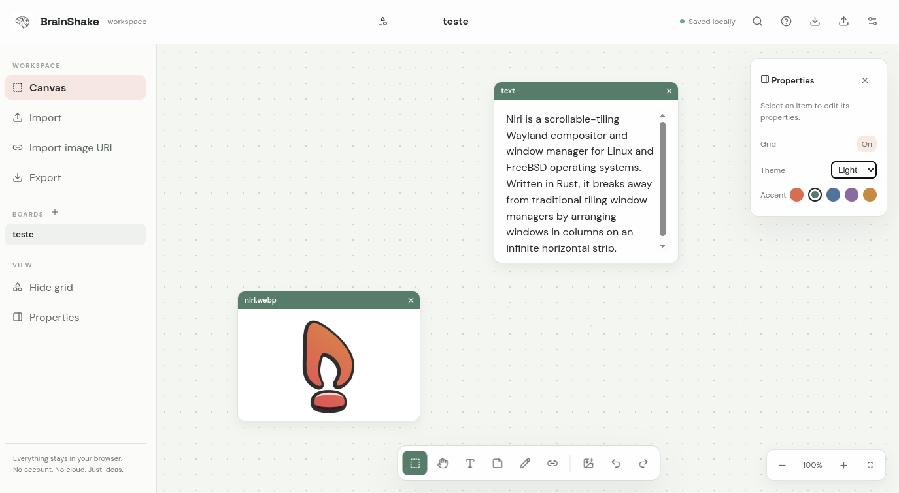
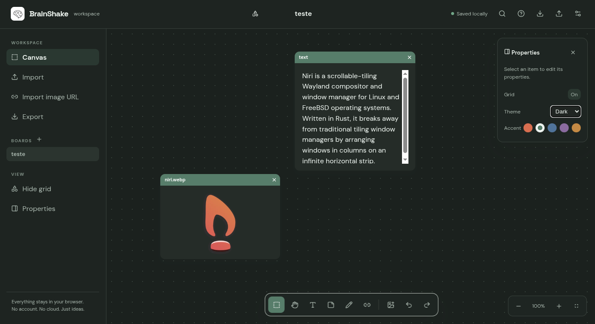
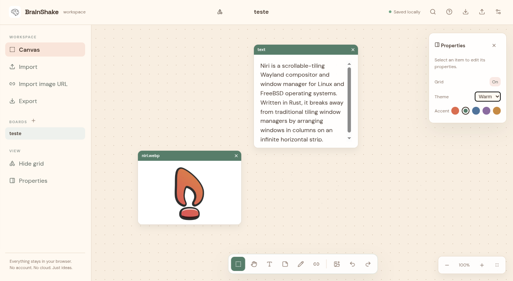
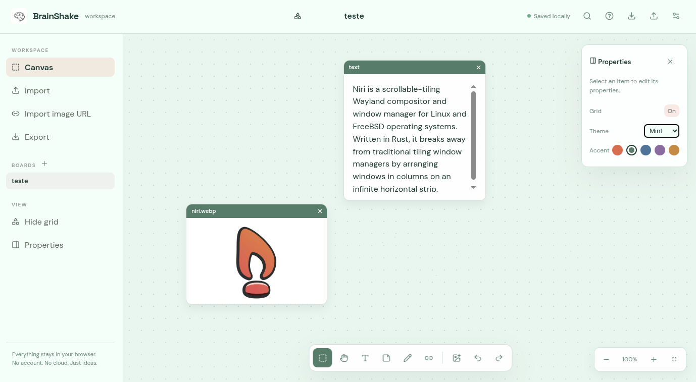

<div align="center">

# BrainShake

### A local-first, libre, and free canvas website.

Create notes, connect thoughts, draw freely, and bring assets into one focused workspace. No account, no backend, no cloud lock-in.

[](https://github.com/pxdritz1/BrainShake/actions/workflows/deploy.yml)
[](https://react.dev/)
[](https://vite.dev/)
[](LICENSE)

[Open the repository](https://github.com/pxdritz1/BrainShake) · [Support BrainShake](https://ko-fi.com/pxdritz1)

</div>

## See it in action

BrainShake includes light, warm, mint, and dark visual themes. The board stays dense and practical while the canvas remains yours to shape.

| Light | Dark |
| --- | --- |
|  |  |

| Warm | Mint |
| --- | --- |
|  |  |

## Highlights

- Infinite-feeling canvas with scroll zoom, pan, grid controls, multi-selection, movement, and resizing
- Sticky notes, text widgets, images, videos, sandboxed HTML previews, and connectors
- Draggable widget titlebars with accent colors and one-click close controls
- Light, warm, mint, and dark themes with persistent accent customization
- Pen tool for mouse, touch, and stylus input, with strokes preserved after reload
- Import local assets by file picker or drag and drop
- Import web images directly from a URL
- Duplicate, delete, copy, paste, bring to front, and undo or redo changes
- Keyboard shortcuts, context menu, properties panel, and responsive layout
- Autosave to browser storage with `.brainshake.json` export and import
- Static deployment configured for GitHub Pages

Imported assets are stored as Data URLs so images, videos, and HTML previews remain available after reopening the page. Large files can exceed the browser's `localStorage` quota; when that happens, export the board as a `.brainshake.json` backup.

## Run locally

```bash
npm install
npm run dev
```

Open the local URL shown by Vite. To create a production build:

```bash
npm run build
npm run preview
```

## Support

If BrainShake helps your workflow, you can support its development:

<div align="center">

[](https://ko-fi.com/pxdritz1)

</div>

## Project status

BrainShake is an actively evolving browser canvas. The project is intentionally small, local-first, and easy to run, inspect, and deploy.
